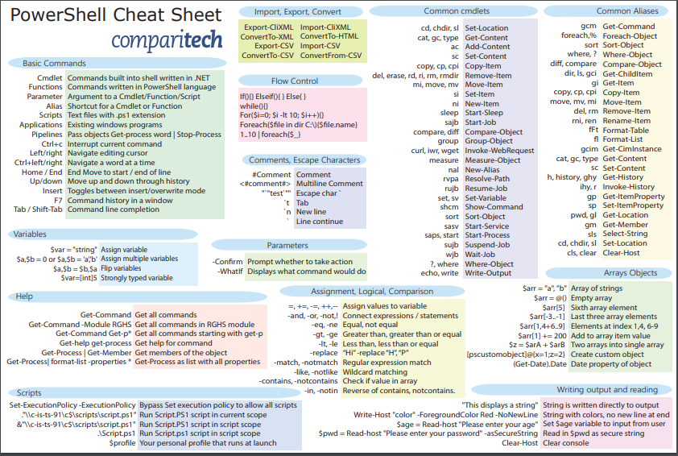

# Shell-data-processing

## Basic Powershell Commands
- To create a folder
```
mkdir 'folder name'
```
- To create a new item
```
ni 'file name'
```
- To delete file or folder
```
del 'file name'
```
- To set current working directory to a specified directory
```
cd 'specified folder path'
```
- To go back one folder up
```
cd..
````
- To view the content of a directory
```
dir
```
### Powershell Cheat sheet:


### Curl command:
- Work in the project folder you created above.
- Find an interesting web page (for example http://shakespeare.mit.edu/romeo_juliet/full.html (Links to an external site.)).
- Copy the URL to your clipboard. Hint: In windows, CTRL C.
- Use curl to return the page text. Hint: curl "url"  (quotes are required - use your custom URL)
- Use curl to return the page text and output to a file. Hint: try one of these, replacing your long url with the actual URL of your chosen web - page.
```
curl "http://shakespeare.mit.edu/romeo_juliet/full.html" -O 
curl "http://shakespeare.mit.edu/romeo_juliet/full.html" -O "data.txt"
```
- To request content from an HTTPS url, you may need to use the following command:
[Net.ServicePointManager]::SecurityProtocol = [Net.SecurityProtocolType]::Tls12

### To process text data:

- Using some Bash commands to process the text.
Transform each space ' ' into a return character '\12' (aka ASCII line feed) [2]
```
 tr ' ' '\12' < data.txt
```
Functionally, this "flat maps" each line into individual words. 
Pipe the output to sort (send the results of one command as input into another command)
```
tr ' ' '\12' < data.txt | sort
```
Pipe the sorted output to uniq -c to count
```
tr ' ' '\12' < data.txt | sort | uniq -c
```
Pipe the reduced output to sort with -nr flag
```
tr ' ' '\12' < data.txt | sort | uniq -c | sort -nr
```
Redirect the output to result.txt
```
tr ' ' '\12' < data.txt | sort | uniq -c | sort -nr > result.txt
```

### Files

- [data.txt](./data.txt)
- [result.txt](./result.txt)